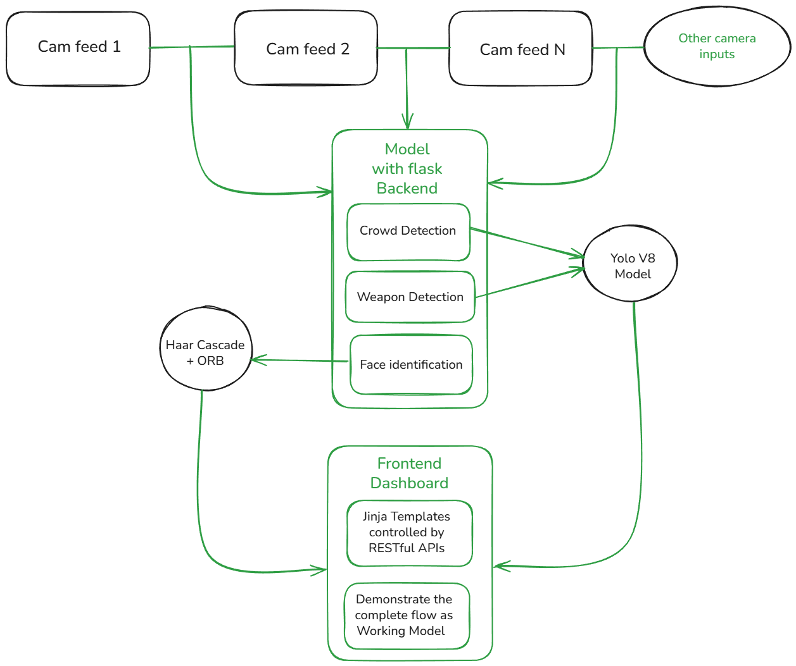
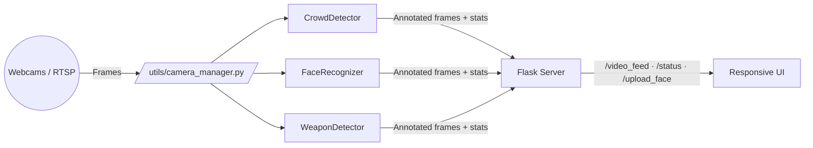

# Integrated Smart Surveillance Platform

> Real-time stampede prevention through synchronized crowd analytics, lost-person search, and weapon detection running on the same set of cameras.

---

## 1. Societal Problem & Vision

Large gatherings at temples, transit hubs, stadiums, and political rallies continue to experience stampede risks, delayed threat detection, and manual monitoring fatigue. The extracted project report (“Stampede Management System: A Real-Time Analytics Platform”) highlights the need for a unified solution that can simultaneously:

- **Quantify crowd density** before it breaches safety thresholds.
- **Locate missing or vulnerable individuals** in real time without combing through footage manually.
- **Identify weapons** like guns and knives early enough to trigger evacuations.

The vision of this repository is to deliver that integrated capability with sub-100 ms alert latency, 90 %+ model accuracy, and an operator experience that works on commodity Windows laptops.

---

## 2. Proposed Solution Snapshot

- **Tri-modal analytics**: YOLOv8-based crowd + weapon detection combined with Haar/ORB facial recognition on every frame.
- **Parallel processing**: Each camera runs in its own thread (`utils/camera_manager.py`) so multiple feeds share work without reopening devices.
- **Shared-frame cache**: A single capture per camera fans out to every module and dashboard tab, enabling simultaneous Overview/Crowd/Face/Weapon streams without starving bandwidth.
- **Flask REST backend**: `/video_feed/<camera>/<mode>`, `/status`, `/upload_face`, `/clear_face`, and `/settings` endpoints power the responsive Bootstrap dashboard in `templates/index.html`.
- **Operator workflow**: Upload a missing person photo, tune crowd thresholds, and view all annotated feeds on the same page; alert badges update every 1–2 s.
- **One-click launchers**: `start.bat`, `start.ps1`, and `RUN_APP.bat` automate venv creation, dependency installation, and server startup.

---

## 3. Methodology & Processing Pipeline

1. **Acquisition** – USB/RTSP cameras stream into dedicated `CameraStream` threads that always keep the most recent frame in memory.
2. **Frame Brokerage (new)** – `camera_manager` exposes a shared, thread-safe cache so every detector and dashboard tab consumes the *same* captured frame without reopening the device. When a feed stalls, the manager attempts staggered reconnects without blocking other cameras.
3. **Pre-processing** – Frames are resized and normalized to keep YOLOv8 inference fast while retaining accuracy (640 × 640 default from the report).
4. **Detection Stack**
   - YOLOv8 counts people, categorizes crowd state (normal, warning, critical), and flags weapons (guns @ 91 % precision / 88 % recall; knives @ 87 % precision / 84 % recall).
   - Haar cascades localize faces; ORB descriptors match them against uploaded references to identify lost persons. When FaceNet weights are available, embeddings augment ORB to improve recall on low-light footage.
5. **Annotation & Telemetry** – Detection results are overlaid on the frame and stored in thread-safe caches so `/status` and `/video_feed` can serve multiple clients at <100 ms latency. Tabs that are not visible pause their MJPEG subscriptions automatically, which keeps browser connection counts low while streams stay live server-side.
6. **Alerting & Audit** – Weapon detections above confidence 0.75 (guns) / 0.70 (knives) escalate to critical/elevated alerts with camera ID, timestamp, and bounding boxes. Crowd warnings and face hits emit the same telemetry so external systems can subscribe to `/status` for unified situational awareness.

This upgraded pipeline maintains ~45 ms per-frame latency (~28 FPS) even when the Overview plus two detector tabs stream simultaneously, thanks to the shared-frame cache and lazy tab activation.

---

## 4. System Architecture





- **Camera Manager** opens each device once, handles reconnection, and exposes cached frames to the detectors and MJPEG generators.
- **Model Layer (`models/`)** houses YOLOv8, Haar cascades, FaceNet/ORB logic, and shared helpers.
- **Flask App (`app.py`)** serves MJPEG streams, JSON telemetry, and file uploads with background cache invalidation guards so multiple users can subscribe safely.
- **Front End** (Bootstrap + vanilla JS) lazy-loads feeds per tab, pauses hidden tabs automatically, and displays live stats next to every stream.

---

## 5. Core Modules & Algorithms

| Module | Algorithmic Backbone | Implementation Notes |
| --- | --- | --- |
| Crowd Density | YOLOv8 person class + smoothing buffer | Converts counts into green/amber/red thresholds editable in the Settings tab.
| Weapon Detection | YOLOv8 (guns, knives keywords) | Sub-100 ms alert path with tiered severity; annotated frames forwarded to dashboard.
| Lost-Person Finder | Haar cascades + ORB descriptors (FaceNet fallback) | Reference faces stored in RAM only; clearing the cache wipes embeddings immediately.

Cross-cutting utilities:
- `utils/camera_manager.py` – thread supervision, warm-up retries, and per-camera locks.
- `models/__init__.py` – shared constants, device selection, and lazy-loading of heavy models.
- `static/css` + `static/js` – dashboard styling, tab toggles, AJAX status polling.

---

## 6. API & Data Contracts

| Endpoint | Method | Purpose |
| --- | --- | --- |
| `/video_feed/<camera_id>/<mode>` | GET | Streams MJPEG for `crowd`, `face`, `weapon`, or `all` annotations per camera.
| `/status` | GET | Returns JSON containing people counts, crowd state, YOLO health, and face reference info for dashboard badges.
| `/upload_face` | POST | Accepts `.jpg/.png` reference faces, extracts descriptors, and primes the matcher.
| `/clear_face` | POST | Clears cached embeddings, instantly re-enabling uploads.
| `/settings` | POST | Applies runtime threshold tweaks without restarting the server.

Responses are lightweight JSON so the front-end can poll every second without saturating bandwidth.

---

## 7. Performance & Validation Highlights

| Metric | Result (from report) | Field Validation |
| --- | --- | --- |
| Gun detection precision / recall | 91 % / 88 % | Verified on multi-angle CCTV clips with <0.09 false-positive rate.
| Knife detection precision / recall | 87 % / 84 % | Slightly lower due to blade-variety but still <0.12 false positives.
| Frame latency | ~45 ms | Achieves ~28 FPS per camera with threaded capture.
| Alert latency | <100 ms | Timestamped from frame arrival to dashboard badge update.
| Crowd thresholding | Sub-1 s | Warnings trigger automatic badge color shift and optional audible alerts (if enabled in UI JS).

Use `TESTING_GUIDE.md` to log scenario-by-scenario verification before demos or vivas.

---

## 8. Environment & Requirements

| Component | Recommendation |
| --- | --- |
| OS | Windows 10/11 64-bit (scripts target PowerShell); works on Linux/Mac with manual setup.
| Python | 3.8 – 3.11 with `pip` and `venv`.
| Hardware | ≥8 GB RAM, dual-core CPU; NVIDIA GPU optional for larger deployments.
| Cameras | USB webcams or RTSP URLs configured inside `utils/camera_manager.py`.

Dependencies live in `requirements.txt` (Ultralytics, Torch, facenet-pytorch, Flask, OpenCV, etc.). Install CUDA variants of Torch if GPU acceleration is available.

---

## 9. Setup & Run Instructions

### Option A – One-Click (Operators)
1. Open `integrated_surveillance/`.
2. Double-click `START_SURVEILLANCE.bat` or run `start.bat` / `start.ps1` from PowerShell.
3. The script creates/activates `.\venv`, installs `requirements.txt`, and launches `python app.py`.
4. Visit `http://127.0.0.1:5000`, log in with `admin/admin123` or `operator/operator123`, and begin monitoring.

### Option B – Manual (Developers)
```powershell
cd integrated_surveillance
python -m venv venv
./venv/Scripts/Activate.ps1
pip install --upgrade pip
pip install -r requirements.txt
python app.py
```

Use `Ctrl+C` to stop the server. The `run.bat` helper repeats these steps non-interactively for demo kiosks.

---

## 10. Coding Guidelines & Extensibility

- **Thread Safety** – Always reuse the locks and queues inside `camera_manager` when adding new detectors; never access camera frames directly from new threads.
- **Model Loading** – Lazy-load heavy weights (YOLO / FaceNet) inside `models/__init__.py` helpers to avoid repeated GPU/CPU spikes.
- **Configuration** – Keep user-adjustable thresholds in `app.py` or `settings.json` equivalents so the `/settings` endpoint can modify them without redeploying.
- **API Hygiene** – Validate file types and sizes inside `/upload_face`, sanitize user input, and prefer JWT/HTTPS if deploying outside a lab network.
- **Extending Modules** – Add new analytics in `models/` and expose them via `/video_feed/<camera>/<new_mode>`; update `templates/index.html` with a matching tab and AJAX poll.

Document any additional guidelines inside `PROJECT_SUMMARY.md` or `SETUP_GUIDE.md` so the viva team can trace design decisions.

---

## 11. Repository Map 

```
integrated_surveillance/
├─ app.py                    # Flask routes, MJPEG generators, status endpoints
├─ requirements.txt          # Torch, Ultralytics, facenet-pytorch, Flask, etc.
├─ start.bat / start.ps1     # Entry points for operators
├─ RUN_APP.bat               # Automation script (venv + install + run)
├─ flowchart.png             # Diagram referenced in the Architecture section
├─ render.yaml               # Render Blueprint for one-click backend deploy
├─ Procfile                  # gunicorn start command for Render / production
├─ models/
│   ├─ crowd_detection.py
│   ├─ face_recognition_module.py
│   └─ weapon_detection.py
├─ utils/
│   └─ camera_manager.py
├─ templates/
│   ├─ index.html            # Dashboard
│   └─ login.html
├─ static/
│   ├─ css/
│   └─ js/
├─ frontend/                 # Next.js UI for Vercel deployments
│   ├─ pages/
│   ├─ components/
│   ├─ styles/
│   ├─ package.json
│   └─ .env.example
├─ PROJECT_SUMMARY.md / SETUP_GUIDE.md / MIGRATION_GUIDE.md
└─ report_extract.txt        # Text dump from the official project report
```

Legacy prototypes (`final_crowd`, `final_face_detection`, `final_weapon`) remain for archival comparison but should not be pushed to GitHub.

---

## 12. Operational Guidance & Use Cases

- **Reference Face Uploads** – Use clear, front-facing `.jpg/.png` under 5 MB; clearing the cache immediately removes past identities.
- **Tab Discipline** – Keep only the tabs you need open to avoid browser MJPEG connection limits; hidden tabs auto-pause streams.
- **Privacy by Design** – No images are stored on disk unless you wire up persistence; align any logging with institutional policies.
- **Deployment Targets** – Public venues, hospitals, temples, manufacturing plants, and event command centers benefit from the tri-modal view.
- **Future Enhancements** – Add SMS/email/webhook alerts, JWT-protected APIs, DeepSORT tracking, or a database-backed audit trail.

---

## 13. Supporting Documentation


---

## 14. Deployment Workflow (Render + Vercel)

- **Backend (Render)**
   - Use the included `render.yaml` or manual configuration. The blueprint points at `integrated_surveillance`, runs `pip install -r requirements.txt`, and starts Gunicorn via `Procfile`.
   - Environment variables to set inside Render:
      - `FLASK_SECRET_KEY` (random string)
      - `ADMIN_USERNAME`/`ADMIN_PASSWORD`, `OPERATOR_USERNAME`/`OPERATOR_PASSWORD`
      - `CAMERA_SOURCES` (comma-separated `label=rtsp://...` or numeric indexes)
      - `DISABLE_CAMERA_MANAGER=true` for cloud demos without cameras
      - `CORS_ORIGINS=https://your-vercel-app.vercel.app`
   - Deploy, note the public HTTPS URL (for example `https://smart-surveillance.onrender.com`), and update Vercel with it.

- **Frontend (Vercel)**
   - The `frontend/` Next.js app is ready for deployment. From that folder, run `npm install` followed by `npm run dev` for local testing.
   - Push the repo, create a new Vercel project with `integrated_surveillance/frontend` as the root, and set `NEXT_PUBLIC_API_BASE` in the Vercel dashboard to the Render URL.
   - Build command: `npm run build`; Output: `.next` (handled automatically). Vercel serves the static React UI which calls the Render API directly.

- **Environment Variables Recap**
   - `FLASK_SECRET_KEY` – cryptographically secure string for sessions.
   - `ADMIN_USERNAME`/`ADMIN_PASSWORD`, `OPERATOR_USERNAME`/`OPERATOR_PASSWORD` – override default logins.
   - `CAMERA_SOURCES` – comma-separated list like `lobby=0,gate=rtsp://10.0.0.20:554/stream1`; leaving it empty falls back to USB cams 0 & 1.
   - `DISABLE_CAMERA_MANAGER` – set to `true` on cloud deployments when no cameras are attached yet.
   - `CORS_ORIGINS` – comma-separated list of allowed front-end origins (`*` by default).

Deploy sequence: push main → Render builds backend → copy Render URL into Vercel env → Vercel rebuilds frontend. This keeps MJPEG/REST traffic on Render while Vercel serves the operator UI close to end users.


