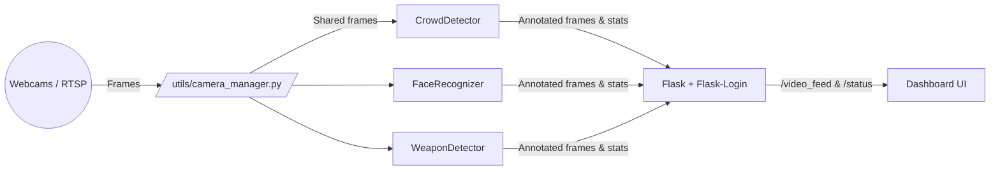

# Integrated Smart Surveillance Platform

> Real-time situational awareness through unified crowd analytics, face recognition, and weapon detection – delivered inside a single Flask dashboard.

This workspace hosts every iteration of the project. The actively maintained application lives inside `integrated_surveillance/`; the other `final_*` folders are legacy modules retained for reference only. Push **only** the `integrated_surveillance` directory to GitHub.

---

## 1. Solution Highlights

- **Tri-Modal Analytics** – Crowd density estimation, target face lookup, and weapon spotting can run concurrently on the same cameras.
- **Shared Camera Core** – `utils/camera_manager.py` opens each webcam/RTSP feed exactly once and shares frames with all detectors to conserve bandwidth.
- **Modern CV Stack** – Flask, OpenCV, Ultralytics YOLOv8, and FaceNet (facenet-pytorch) wrapped in a responsive Bootstrap UI.
- **Operator-Friendly Controls** – Toggle modules, adjust crowd thresholds, upload/clear reference faces, and review live stats without restarting the server.
- **One-Click Launchers** – `.bat` scripts set up Python environments, install requirements, and start the dashboard for non-technical users.

---

## 2. System Flow & Architecture


1. **Capture** – `CameraStream` threads continuously store the most recent frame per camera.
2. **Processing** – `app.py` routes each MJPEG request (crowd/face/weapon/all) through the relevant model pipeline, caching outputs to sustain multiple viewers.
3. **Telemetry** – `/status` exposes people counts, face reference state, and YOLO readiness for dashboard widgets or external integrations.
4. **Presentation** – `templates/index.html` renders camera grids, module tabs, and operator controls, lazy-loading feeds per tab to honor browser connection limits.

---

## 3. Module Deep Dive

| Module | Core File | Technique | Key Notes |
| --- | --- | --- | --- |
| Crowd Detection | `models/crowd_detection.py` | Haar cascades + smoothing buffer | Color-coded overlays signal safe vs. high density; thresholds adjustable in Settings.
| Face Recognition | `models/face_recognition_module.py` | FaceNet embeddings with ORB/Histogram fallback | Reference faces reside only in memory; UI resets automatically when cleared.
| Weapon Detection | `models/weapon_detection.py` | Ultralytics YOLOv8n with keyword filtering | Thread-safe inference cache prevents competing requests from starving feeds.

Cross-cutting utilities:
- `models/__init__.py` wires shared helpers.
- `utils/camera_manager.py` manages camera lifecycle, reconnection, and thread safety.
- `static/` + `templates/` provide the Bootstrap-based operator console.

---

## 4. Requirements & Environment

| Category | Recommendation |
| --- | --- |
| OS | Windows 10/11 (64-bit) – scripts target PowerShell + `venv`.
| Python | 3.8 – 3.11 (install from python.org with “Add to PATH”).
| Hardware | Dual-core CPU, 8 GB RAM minimum, NVIDIA GPU optional for faster YOLO inference.
| Cameras | USB webcams or RTSP IP cameras (configured inside `camera_manager`).

Dependencies are pinned in `integrated_surveillance/requirements.txt`. Torch/Ultralytics wheels are CPU versions by default; install CUDA builds if available.

---

## 5. Setup & Launch Steps

### Option A – One-Click (Recommended for operators)
1. Navigate to `integrated_surveillance/`.
2. Double-click `START_SURVEILLANCE.bat` (or run from PowerShell). This calls `RUN_APP.bat`, which:
   - Creates/activates `.\venv` if missing.
   - Runs `pip install -r requirements.txt`.
   - Launches `python app.py`.
3. Wait for the console message `INTEGRATED SURVEILLANCE SYSTEM` and open `http://127.0.0.1:5000` in a browser.
4. Log in with `admin/admin123` or `operator/operator123` (credentials in `app.py`).

### Option B – Manual (for developers)
```powershell
cd integrated_surveillance
python -m venv venv
./venv/Scripts/Activate.ps1   # PowerShell
pip install --upgrade pip
pip install -r requirements.txt
python app.py
```

Terminate the server with `Ctrl+C`. Use `start.ps1` or `start.bat` for scripted launches.

---

## 6. Dashboard Walkthrough

1. **Login Page** – Simple Flask-Login form with flash messaging.
2. **Overview Tab** – Two combined feeds (Camera 0 & 1) with crowd counts, face status, and threat level indicators.
3. **Crowd Tab** – Dedicated feeds plus badge indicators showing live counts vs. threshold.
4. **Face Tab** – Upload/preview area, instructions, reference status card, and per-camera feeds.
5. **Weapon Tab** – Two feeds with weapon-specific overlays and warning banners.
6. **Settings Tab** – Enable/disable modules, toggle overlays, and tune crowd thresholds via AJAX.

Interactions are backed by `/upload_face`, `/clear_face`, `/settings`, and `/status` endpoints, enabling live updates without refreshing the page.

---

## 7. Operational Guidelines

- **Reference Faces** – Use single-person, front-facing, well-lit images. Clearing the reference immediately re-enables the upload panel.
- **Camera Tabs** – Keep only the tabs you are monitoring active to respect browser MJPEG connection limits. Hidden tabs automatically release streams.
- **Security** – Store credentials securely if deploying beyond demos; integrate with a database-backed user model for production.
- **Performance** – Disable overlays or reduce resolution in `camera_manager` for low-power devices; consider GPU-enabled PyTorch for larger deployments.
- **Data Privacy** – No images are persisted by default. Add disk/database storage only if it aligns with your privacy policy.

---

## 8. Real-World Applications

- **Public Venues** – Malls, stadiums, transit hubs monitoring density + threats.
- **Institutions** – Schools, banks, hospitals requiring controlled access and weapon alerts.
- **Industrial Sites** – Track staffing levels while searching for VIPs or flagged individuals.
- **Events & Crowd Control** – Manage evacuation routes via threshold alerts, locate missing persons quickly.

---

## 9. Project Structure & File Significance

```
IP_final Smart Surveillance/
├─ README.md                        # Comprehensive project brief (this file)
├─ integrated_surveillance/         # Active application – push this directory
│  ├─ app.py                        # Flask entry point, routes, MJPEG streaming
│  ├─ START_SURVEILLANCE.bat        # Operator launcher (calls RUN_APP.bat)
│  ├─ RUN_APP.bat / start.bat/.ps1  # Automation scripts for setup/run
│  ├─ requirements.txt              # Python dependencies
│  ├─ yolov8n.pt                    # YOLOv8n weights for weapon detection
│  ├─ flowchart.png                 # Architecture diagram referenced in README
│  ├─ models/                       # Crowd, face, weapon modules
│  ├─ utils/                        # Camera manager and helpers
│  ├─ templates/                    # Flask HTML (dashboard & login)
│  └─ static/                       # CSS, JS, assets
├─ final_crowd/                     # Legacy crowd-only prototype (archive)
├─ final_face_detection/            # Legacy face-only prototype (archive)
└─ final_weapon/                    # Legacy weapon-only prototype (archive)
```

Key supporting documents (all inside `integrated_surveillance/`):

- `PROJECT_SUMMARY.md` – feature breakdown and backlog.
- `SETUP_GUIDE.md` – step-by-step environment instructions with screenshots.
- `DEBUGGING_GUIDE.md` / `BUG_FIXES.md` – troubleshooting history.
- `MIGRATION_GUIDE.md` – explains consolidation from individual modules.
- `TESTING_GUIDE.md` – outlines manual verification flows.

---

## 10. Testing & Validation Checklist

1. **Environment** – `pip install -r requirements.txt` completes with no errors.
2. **Camera Health** – `/status` returns `running: true` for configured cameras.
3. **Crowd Module** – Threshold badge switches to “danger” when exceeding the limit.
4. **Face Module** – Upload a reference, verify overlays show the provided name; clear and confirm UI reset.
5. **Weapon Module** – Load sample footage or images from `final_weapon/` to confirm YOLO draws alerts.
6. **Concurrency** – Open Overview + two module tabs to ensure caching keeps streams responsive.

Document results in `TESTING_GUIDE.md` when presenting or defending the project.

---

## 11. Troubleshooting Quick Reference

| Symptom | Action |
| --- | --- |
| “Camera X not available” overlay | Confirm no other app uses the webcam; adjust IDs in `camera_manager.initialize_default_cameras()`.
| Feeds show “unavailable” after browsing multiple tabs | Wait a second for lazy reload; tabs now release streams when hidden.
| Face upload fails | Ensure `.jpg/.png` file < 5 MB with a single face; console logs show `[FaceRecognizer]` messages.
| YOLO model not loading | Verify `yolov8n.pt` is present; re-run `pip install ultralytics` inside the venv.
| Slow UI | Disable overlays in Settings or lower frame size in `CameraStream` constructor.

---

## 12. Publishing to GitHub

Only the `integrated_surveillance/` folder is required for source control. From the workspace root:

```bash
cd integrated_surveillance
git init
git add .
git commit -m "Initial smart surveillance release"
git branch -M main
git remote add origin <your-remote-url>
git push -u origin main
```

Before committing, create `.gitignore` entries for `venv/`, `__pycache__/`, `.DS_Store`, and log files. Keep model weights if your policies allow; otherwise replace `yolov8n.pt` with download instructions.

---

## 13. Future Enhancements

- Integrate SMS/Email/webhook alerts when thresholds are breached.
- Add database persistence for audit logs and face galleries with consent workflows.
- Expand to multi-node deployments via WebRTC or RTSP rebroadcasting.
- Introduce analytics dashboards (Grafana/PowerBI) pulling from `/status`.

---

With this documentation, the project can be handed off, evaluated, or deployed with minimal additional explanation. Every file of interest is cataloged above, and the workflow — from camera capture to operator action — is fully traceable.

This workspace contains every iteration of the Smart Surveillance project. The actively maintained implementation lives in `integrated_surveillance/`, which unifies crowd counting, face recognition, and weapon detection behind a single Flask dashboard. The legacy `final_*` folders are preserved only for reference/migration purposes.

---

## Platform Overview

- **Stack**: Flask + OpenCV + Ultralytics YOLOv8 + FaceNet (facenet-pytorch) running on Windows 10/11.
- **Cameras**: Shared capture threads managed by `utils/camera_manager.py`, serving concurrent MJPEG streams to the UI.
- **Modules**: Crowd density estimation, target face lookup, and weapon detection can be toggled independently yet operate on the same frames.
- **Entry Points**:
  - `integrated_surveillance/START_SURVEILLANCE.bat` – portable launcher for local operators.
  - `integrated_surveillance/RUN_APP.bat` – one-click setup (venv + requirements + server start).
  - `integrated_surveillance/app.py` – Flask server for manual execution.

---

## High-Level Flow



1. Each physical camera is opened once; `CameraStream` threads keep the latest frame ready in memory.
2. When a browser requests `/video_feed/<camera>/<module>`, `app.py` pulls the cached frame, runs the requested detector, and streams JPEG chunks.
3. `/status` exposes aggregated telemetry (crowd counts, face match state, weapon model health) for the dashboard stats cards.
4. The UI uses lazy initialization so only the visible tab consumes MJPEG connections.

---

## Module Workflows

### Crowd Detection
- Haar cascade locates heads/bodies, smoothed across frames to reduce flicker.
- Thresholds are configurable at runtime (settings tab, `/status`).
- Overlays switch from green to red when density exceeds the configured limit.

### Face Recognition
- Operators upload a reference face through the dashboard.
- FaceNet embeddings (InceptionResnetV1) run when available; otherwise a hybrid ORB+histogram matcher kicks in.
- Reference data stays in memory only – no on-disk persistence for privacy.

### Weapon Detection
- Ultralytics YOLOv8n weights (`yolov8n.pt`) load once at startup.
- Detection keywords (`gun`, `knife`, etc.) are filtered to minimize false positives.
- Annotated frames display red banners and text overlays when weapons are found.

---

## Setup & Usage

### One-Click (Recommended)
1. Open `integrated_surveillance/`.
2. Double-click `START_SURVEILLANCE.bat` (or run it from PowerShell). It automatically runs `RUN_APP.bat`, which:
   - Creates/activates `.\venv`.
   - Installs dependencies from `requirements.txt`.
   - Launches `python app.py`.
3. Navigate to `http://127.0.0.1:5000`.
4. Log in with `admin / admin123` (or `operator / operator123`).

### Manual
```powershell
cd integrated_surveillance
python -m venv venv
.\venvinash? # Windows uses Scripts
.\venv\Scripts\activate
pip install -r requirements.txt
python app.py
```
(Use `python app.py --help` for optional CLI overrides if you add any.)

### Operator Guidelines
- Upload one clear, front-facing photo at a time; clearing the reference resets the UI instantly.
- Keep only the needed tab active to preserve browser MJPEG connection limits.
- For best performance enable an NVIDIA GPU build of PyTorch (optional).

---

## Applications & Deployment Ideas
- **Public Safety**: Monitor malls, transit hubs, campuses for crowd surges or concealed weapons.
- **Critical Infrastructure**: Authenticate staff via face recognition plus detect unauthorized devices.
- **Events Management**: Track occupancy caps while searching for VIPs or missing persons.

For GitHub deployment, commit only `integrated_surveillance/` (plus its contents). The other folders are historical and can be omitted:
```bash
git init integrated_surveillance
cd integrated_surveillance
git add .
git commit -m "Initial smart surveillance release"
git remote add origin <your-remote>
git push -u origin main
```

---

## Folder Structure

```
IP_final Smart Surveillance/
├─ README.md                  # (this file)
├─ integrated_surveillance/   # Active application codebase (push this)
│  ├─ app.py
│  ├─ START_SURVEILLANCE.bat
│  ├─ RUN_APP.bat / start.bat / start.ps1
│  ├─ requirements.txt / yolov8n.pt
│  ├─ models/
│  ├─ utils/
│  ├─ templates/
│  └─ static/
├─ final_crowd/               # Legacy individual module (unused)
├─ final_face_detection/      # Legacy individual module (unused)
└─ final_weapon/              # Legacy individual module (unused)
```

> **Heads-up:** Keep the `.venv/` folder excluded from Git. If you already created one inside `integrated_surveillance`, add `/venv` to `.gitignore` before pushing.

---

## Additional References
- `integrated_surveillance/SETUP_GUIDE.md` – full installation walkthroughs.
- `integrated_surveillance/MIGRATION_GUIDE.md` – history and rationale for consolidating modules.
- `integrated_surveillance/PROJECT_SUMMARY.md` – feature backlog and testing scenarios.

With this structure you can safely push only the `integrated_surveillance` directory to GitHub while keeping the rest of the workspace for archival reference.
